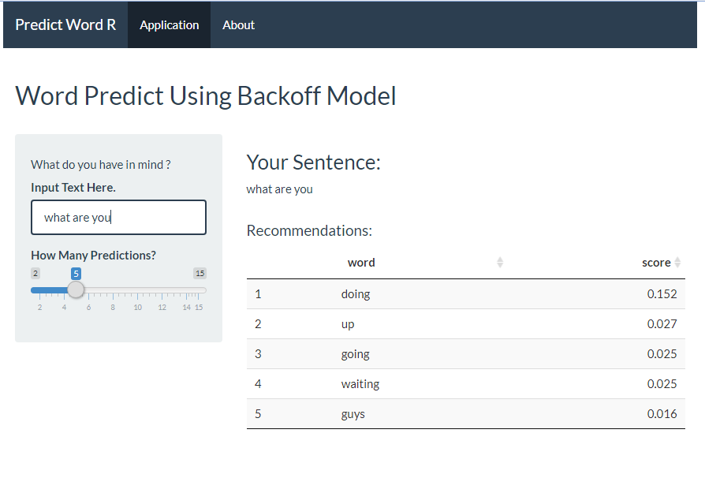

Data Science Capstone: Natural Language Processing Word Prediction
========================================================
author: Leonard
date: 12/8/2020
autosize: true

Introduction
========================================================

This is a final project in Coursera Data Science Specialization by **John Hopkins University**.

This assignment was also done with a collaboration with **Swiftkey** Company.

The task involved processing raw large text data into an application that predict user next word based on previous word. 

The data used is taken from blogs, news and twitter and was already provided for this assignment.  

Data and Exploratory Graph
========================================================

The first task from this capstone was to **understand the data, do tokenization, n-grams, and and create an exploratory graph**. The idea is to break down the text into bigram (pair of 2 words), trigram(pair of three), and so on.

I also **removed profanity** from the text before we further move on to the next step. 

You can find the full report on this task in this article, [Milestone 1](https://rpubs.com/valLeonard/647192)

Modeling Process
========================================================
The Model I've used for this assignment is called **Backoff using relative frequencies (Stupid Backkoff, Brants et al. 2007)**. I've chose this model due to our scope of prediction that is vast and also the simplycity of the model itself. 

Also based on a very good explanation by [Stanford NLP course](https://www.youtube.com/watch?v=naNezonMA7k&list=PLQiyVNMpDLKnZYBTUOlSI9mi9wAErFtFm&index=17). This model is a good method for Web-Scale ngrams. 

================
The algorithm goes as follows:

1. Prepare the **n-gram** data with the frequency of the word appearance. 
2. Look whether word written by the user **match the highest order n-gram data.** (let say five gram is the highest) 
3. If not, look at fourgram (highest - 1), and so on.
4. If the user text match a particular n-gram, and there are list of options, calculate the **score** of an option by calculating the frequencies of an option / sum of total options frequencies. 
5. Everytime we leveled down from the highest n-gram, the score is multiplied by 0.4
6. Give the **highest score**as our prediction. (**Maximum Likelihood Estimation**)

Result
========================================================

The final step is to create the application itself.

Below is the link to the final app, it was created using shiny in R. 

[Word Predict R](https://valensioleonard.shinyapps.io/PredictWord/)

 
