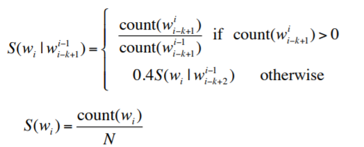

```{r setup, include=FALSE}
knitr::opts_chunk$set(echo = TRUE, eval = FALSE)
```
## Introduction

This will be my final report on the assignment and final project for the Data Science Specialization Capstone by John Hopkins University on Coursera. 

The final project is to deliver an application that predict user next word based on their previous writing. 

This is part 2 of the report and you can find the first milestone report on this link.
[Milestone 1 Report](https://rpubs.com/valLeonard/647192)

In my first analysis, I've removed stopwords from the ngrams data, but I've decided to include it again in this analysis since we will also predict some stopwords for the user. Also, I've used higher amount of data for this analysis.

## Processing The Data into 2-5 N-grams

I've decided to use two until 5 pairs of words for this assignment based on the computational capabilities. I've also excluded unigram from my modeling since it will only spit out words with highest frequencies and wouldn't add much to our model considering the data it will add. 

The processing for this task can be done using these following codes.
```{r}
## Creating Bigram
bigram <- data %>% tokens(what= "word") %>%
   tokens_ngrams(n = 2, concatenator = " ") %>% 
   unlist %>% table() %>% sort(decreasing = T) %>% 
   as.data.table() %>% setNames(., c("word","freq")) %>% 
   .[freq > 4] %>% mutate(., history = word_History(., 2), word = word_Final(., 2))

## For Trigram, Fourgram, and Fivegram, we can simply change the n in token_ngrams function.
```

In my original code, I've created a function to create bigram all the way to fivegram. But since coursera doesn't allow code sharing and to respect [Coursera Code of Honor](https://learner.coursera.help/hc/en-us/articles/209818863-Coursera-Honor-Code). I will be only including several code for this report. 

I've also pruned the ngrams data, in this case removing data with frequencies below 4 as there are a lot of those and probably isn't too useful. In doing this, we also save some memories by cutting down our ngram data. However, in higher order ngrams, I've only removed frequencies equal too one, since the data isn't that big compared to lower order ngrams.

## Backoff with Relative Frequencies

I've chosen Backoff model with relative frequencies for this task which is recommended for Web-Scale Ngrams on this great resource from [Stanford Natural Language Processing](https://www.youtube.com/watch?v=naNezonMA7k&list=PLQiyVNMpDLKnZYBTUOlSI9mi9wAErFtFm&index=17) Course. 



The algorithm for the equation is actually quite simple,

1. Prepare the **n-gram** data with the frequency of the word appearance. 
2. Look whether word written by the user **match the highest order n-gram data.** (let say five gram is the highest) 
3. If not, look at fourgram (highest - 1), and so on.
4. If the user text match a particular n-gram, and there are list of options, calculate the **score** of an option by calculating the frequencies of an option / sum of total options frequencies. 
5. Everytime we leveled down from the highest n-gram, the score is multiplied by 0.4
6. Give the **highest score**as our prediction. (**Maximum Likelihood Estimation**)

### Implementation in R

Below is a peek at what my model code looked like. I will explain only the idea of it. 
```{r, eval=FALSE}
## The function takes user text and how many predictions user wanted.
guess <- function(text, howMany = 5){
        ## It then calculate how many words user input to the function
        n <- str_count(text, "\\w+")
        
        ## break_text is a function that i created to break user text into multiple section, for example,
        ## "I wanted to" become "I wanted" for object three, and "I wanted to" for object four 
        ## The idea is number of words - 1, and so on. 
        
        result <- break_text(text)
        five <- result[[1]] ## User last four words
        four <- result[[2]] ## User last three words
        three <- result[[3]]
        two <- result[[4]] ## User last words
        
        recom <- data.table()
        
        ## First we begin our search in the `fivegram` data, to save some computation, 
        ## we will only look at this chunk if five exists 
        ## meaning we receive at least 4 words from the user
        
        if(!is.na(five) & n > 3){
        ## we then take all the match index and put it into new variable,
        ## then add the possible recommendation into our `recom` data table.
        ## we also calculate the score of an option.
                ind <- like(pattern = five, fivegram$history)
                matchSum <- sum(fivegram$freq[ind])
                recom <- rbind(recom, data.table(word = fivegram$word[ind], 
                                                 score = (fivegram$freq[ind]/matchSum)))
                
        }
        
        ## Do the same process for the trigram
        ## in this case, whether user gave us more than one word to work with.
        if(!is.na(three) & n > 1 ){
                ind <- like(pattern = three, trigram$history)
                matchSum <- sum(trigram$freq[ind])
                recom <- rbind(recom, data.table(word = trigram$word[ind], 
                                                 score = (0.4* 0.4* trigram$freq[ind]/matchSum)))
}
```

## Result

The final task is to build the application itself, you can find the application on this link below to try it out. 

To use the application, simply write a word or a sentence and put how many guesses the program can make !

[Word Predict R by Leonard](https://valensioleonard.shinyapps.io/PredictWord/)

The final app uses around 200-300 Mb of RAM which is fairly reasonable.  


